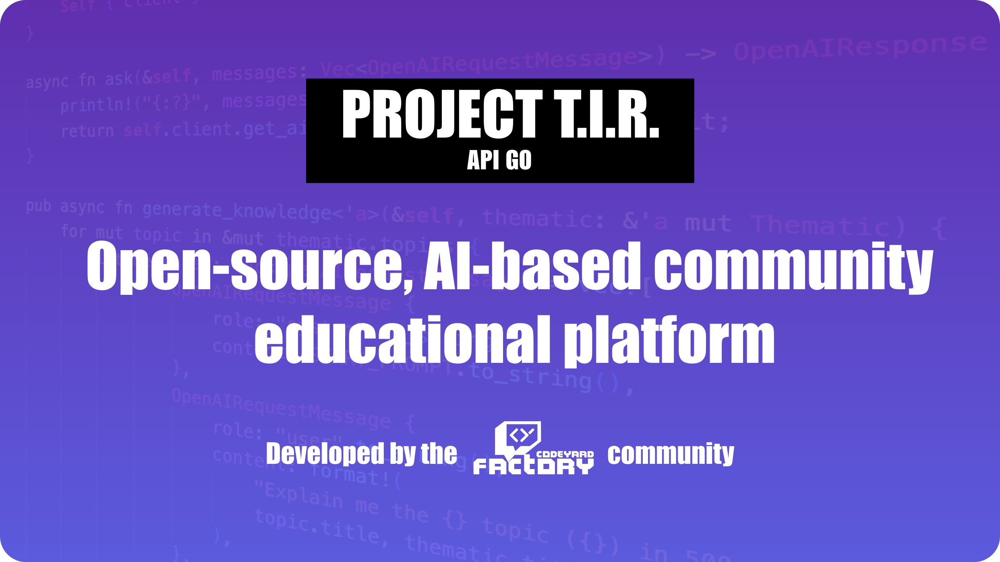

# Project T.I.R GO Lang API



### ⚠️ This repository is currently under development and is not stable for production use. ⚠️

## Introduction

TIR Project is an Open-Source AI-based community educational platform. This project is dedicated to providing an innovative and collaborative platform for learning, with the power of AI at its core. This side is written in Go, but TIR API will be available for other languages as well.

# Repositories

- [TIR Engine](https://github.com/teamcodeyard/tir-engine)
- [TIR API](https://github.com/teamcodeyard/tir-api)
- [TIR Discord Bot?](https://github.com/teamcodeyard/tir-discord)

# Requirements
- [Go](https://golang.org/)
- [PostgreSQL](https://www.postgresql.org/)
- [Protocol Buffers](https://developers.google.com/protocol-buffers)

# Installation
```bash
$ git clone git@github.com:ntfargo/tir-goapi.git
$ cd tir-goapi
$ make run # or make build ( MinGW-w64 if you are on Windows )

# Servers are running on {ProtocolType}://localhost:5211
# gRPC is running on localhost:50051
```

# Similar API Sides
- [TIR Engine Official API](https://github.com/teamcodeyard/tir-api/tree/master)
- [TIR Engine Node](https://github.com/FiddlerZsolt/node-tir-api)

# Contributing
If you'd like to contribute, please follow these simple steps:

- Fork the repository
- Make your changes
- Submit a pull request